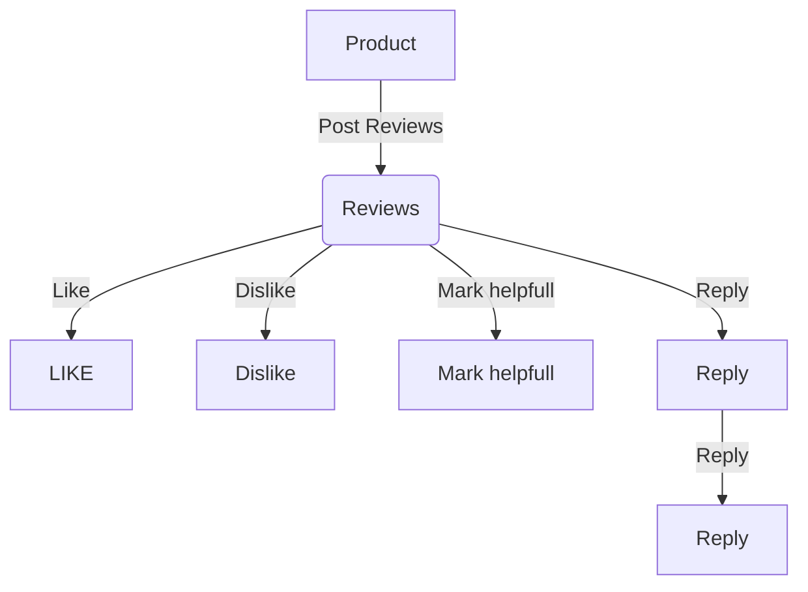
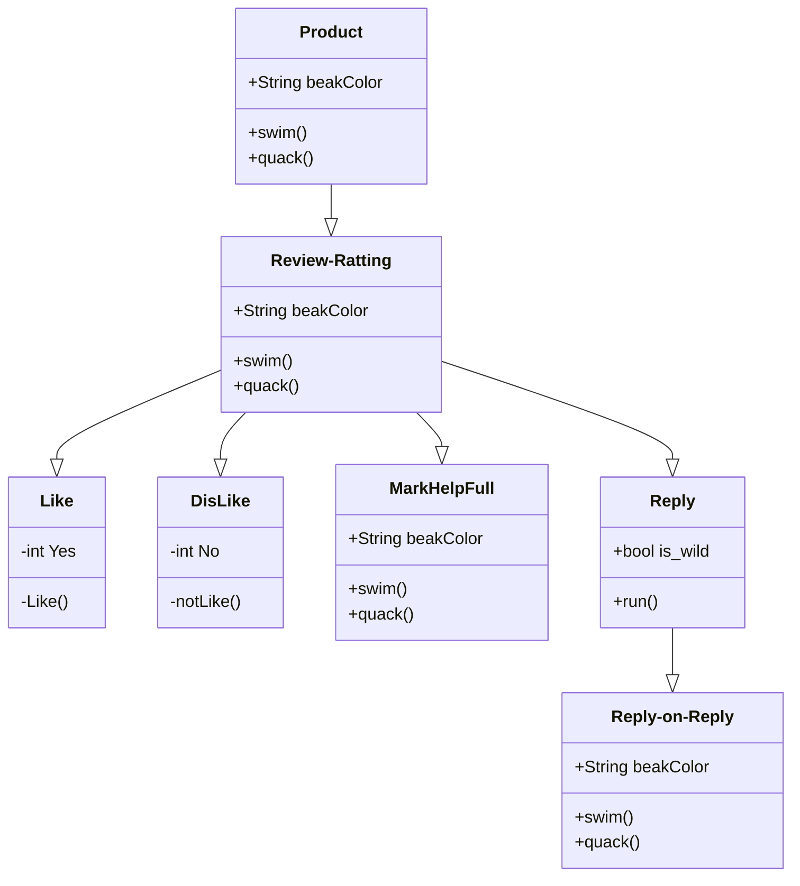

```mermaid
flowchart TD
    A[Product] -->|Post Reviews| B(Reviews)
    
    B-->|Like| D[LIKE]
    B -->|Dislike| E[Dislike]
    B -->|Mark helpfull| F[Mark helpfull]
    B -->|Reply| G[Reply]
    G -->|Reply| H[Reply]
```
### Class Diagrame

```mermaid
classDiagram
    Product --|> Review-Ratting
    Review-Ratting --|> Like
    Review-Ratting --|> DisLike
    Review-Ratting --|> MarkHelpFull
    Review-Ratting --|> Reply
    Reply --|> Reply-on-Reply
    class Review-Ratting{
      +String beakColor
      +swim()
      +quack()
    }
    class MarkHelpFull{
      +String beakColor
      +swim()
      +quack()
    }
    class Like{
      -int Yes
      -Like()
    }
    class DisLike{
      -int No
      -notLike()
    }
    class Reply{
      +bool is_wild
      +run()
    }
    class Product{
      +String beakColor
      +swim()
      +quack()
    }
     class Reply-on-Reply{
      +String beakColor
      +swim()
      +quack()
    }

```
