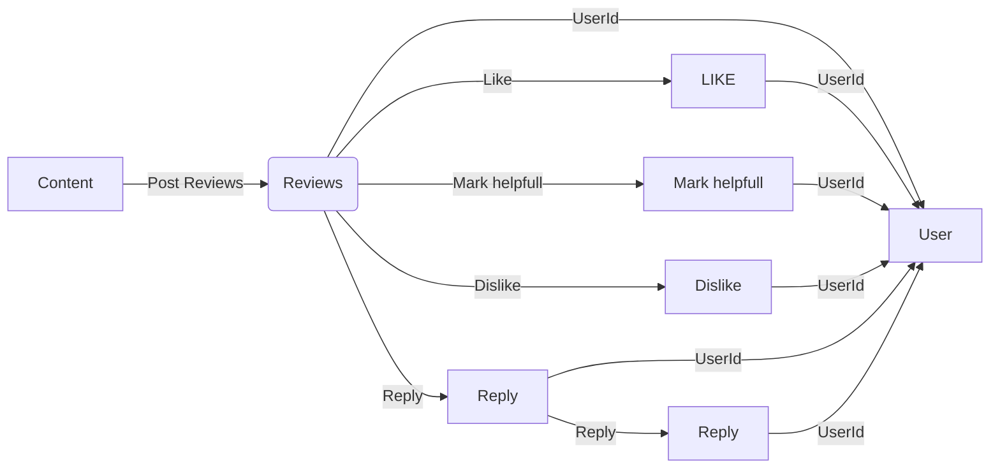
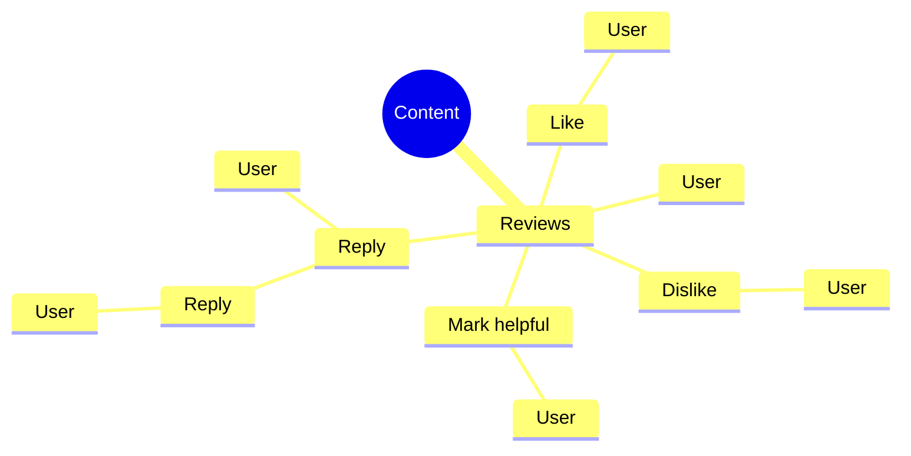
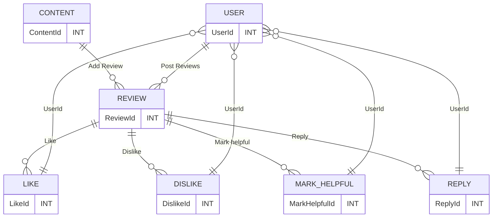

### Content Review and Ratting 

%% Code for flowchart below
graph TB
    sq[Square shape] --> ci((Circle shape))

    subgraph A subgraph2
        od>Odd shape]-- Two line edge comment --> ro
        di{Diamond with   line break} -.-> ro(Rounded square shape)
        di==>ro2(Rounded square shape)
    end

    %% Notice that no text in shape are added here instead that is appended further down
    e --> od3>Really long text with linebreak in an Odd shape]

    %% Comments after double percent signs
    e((Inner / circle and some odd  special characters)) --> f(,.?!+-*ز)

    cyr[Cyrillic]-->cyr2((Circle shape Начало));

     classDef green fill:#9f6,stroke:#333,stroke-width:2px;
     classDef orange fill:#f96,stroke:#333,stroke-width:4px;
     class sq,e green
     class di orange

## Flow Chart

## Mind mapping

## Entity Relationship Diagram

