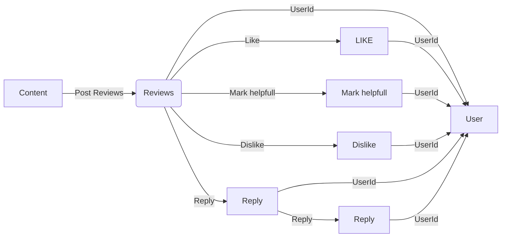
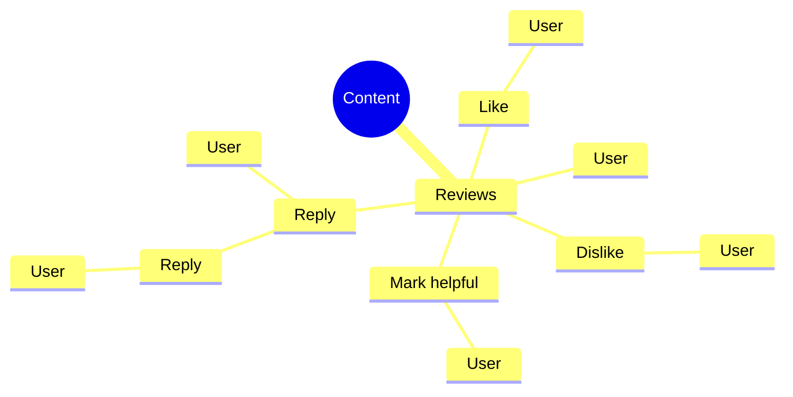
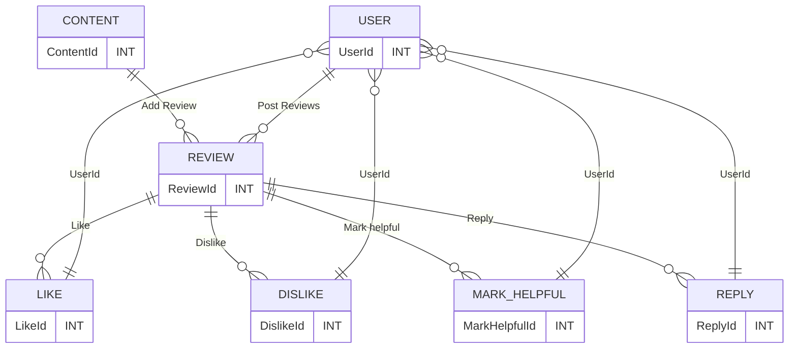

### Content Review and Ratting 

## Flow Chart

``` mermaid
flowchart LR
    A[Content] -->|Post Reviews| B(Reviews)
    B-->|Like| D[LIKE]
    B -->|Dislike| E[Dislike]
    B -->|Mark helpfull| F[Mark helpfull]
    B -->|Reply| G[Reply]
    G -->|Reply| H[Reply]
    B-->|UserId| U[User] 
    D-->|UserId| U[User] 
    F-->|UserId| U[User]
    E-->|UserId| U[User]
    G-->|UserId| U[User]
    H-->|UserId| U[User]
```

## Mind mapping

``` mermaid
mindmap
root((Content))
        Reviews
            User
            Like
                User
            Dislike
                User
            Mark helpful
                User
            Reply
                User
                Reply
                    User
```

## Entity Relationship Diagram

```mermaid
erDiagram
    USER {
        UserId INT
    }

    CONTENT {
        ContentId INT
    }

    REVIEW {
        ReviewId INT
    }

    LIKE {
        LikeId INT
    }

    DISLIKE {
        DislikeId INT
    }

    MARK_HELPFUL {
        MarkHelpfulId INT
    }

    REPLY {
        ReplyId INT
    }
    CONTENT ||--o{ REVIEW : "Add Review"
    USER ||--o{ REVIEW : "Post Reviews"
    REVIEW ||--o{ LIKE : "Like"
    REVIEW ||--o{ DISLIKE : "Dislike"
    REVIEW ||--o{ MARK_HELPFUL : "Mark helpful"
    REVIEW ||--o{ REPLY : "Reply"
    LIKE ||--o{ USER : "UserId"
    DISLIKE ||--o{ USER : "UserId"
    MARK_HELPFUL ||--o{ USER : "UserId"
    REPLY ||--o{ USER : "UserId"
```

