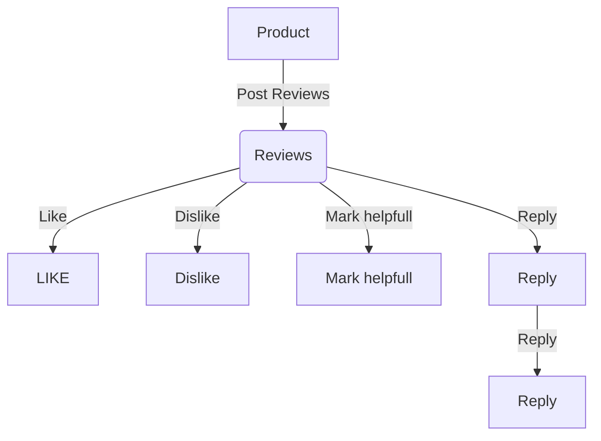

    

```mermaid
flowchart TD
    A[Product] -->|Post Reviews| B(Reviews)
    
    B-->|Like| D[LIKE]
    B -->|Dislike| E[Dislike]
    B -->|Mark helpfull| F[Mark helpfull]
    B -->|Reply| G[Reply]
    G -->|Reply| H[Reply]
```
### Class Diagrame

